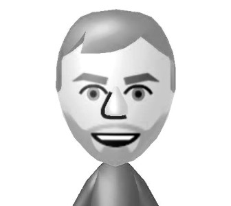

 

The **gapfraction** package for R is the work of [Adam Erickson]("http://blogs.ubc.ca/forests/"), PhD Candidate in the [Integrated Remote Sensing Studio]("http://irsslab.forestry.ubc.ca/") at University of British Columbia. If you have questions, you may email him [here]("adam.erickson@ubc.ca"). Adam is currently a Postdoctoral Researcher at Max Planck Institute for Biogeochemistry in Germany, where he is researching remote sensing and machine learning for the [ESA GlobBiomass]("http://globbiomass.org/") and [COREGAL]("http://www.coregalproject.com/") projects. You can read more about his recent work [here]("https://www.bgc-jena.mpg.de/bgi/index.php/People/AdamErickson"). Follow Adam on Twitter [here]("https://twitter.com/admercs"). Submit issues on GitHub [here]("https://github.com/adam-erickson/gapfraction/issues").

> "Thank you for visiting! I hope you find the software useful." -Adam

