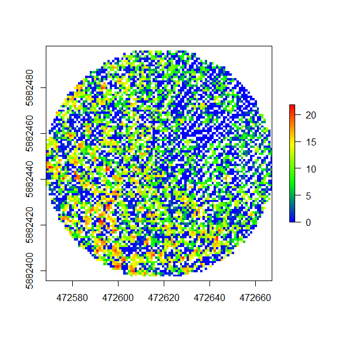
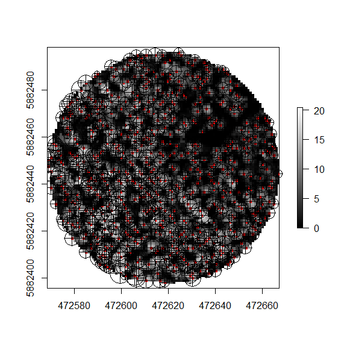
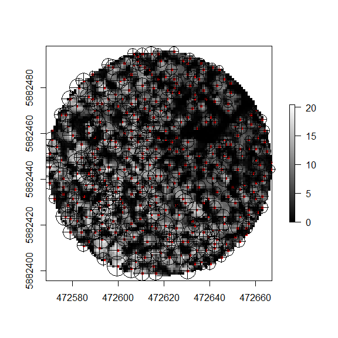

The **gapfraction** package for **R** is designed for processing
airborne laser scanning (ALS) light-detection-and-ranging (LiDAR) data
of forests. A version of the package was implemented in the final
chapter of my doctoral dissertation at University of British
Columbia[1]. The package is designed to be used with LiDAR data
pre-processed with **LAStools**[2] or **USDA Fusion**[3]. The main input
to functions in the gapfraction package are LAS format height-normalized
point clouds, typically LiDAR plots corresponding to field plots. The
compressed LAZ format is not yet supported, as I rely on the **rLiDAR**
`readLAS` function for importing data[4].

Functions Included
------------------

The **gapfraction** package implements my new fast-pit-free canopy
height model (CHM) algorithm based on Khosravipour et al. (2013)[5], two
new LiDAR metrics of canopy gap fraction (*P**o*) and angular
canopy closure (*A**C**C*), several recent individual tree crown (ITC)
detection methods, canopy distance and direction metrics, effective leaf
area index (*L**e*) and apparent clumping index (*A**C**I*)
estimation methods, as well as four mathematical fisheye (hemispherical)
lens models: equi-angular, equi-distant, stereographic, and
orthographic. An alphabetical list of functions in the gapfraction
package is provided below.

-   `chm` - Simple canopy height model
-   `chm.pf` - Fast-pit-free canopy height model
-   `dd.canopy` - Euclidean distance and direction to nearest canopy
    pixel from plot center
-   `dd.crown` - Euclidean distance and direction to nearest tree crown
    from plot centers
-   `fc.aci` - Above-height cover index of fractional canopy cover
-   `fc.bl` - Beer-Lambert-Law-modified intensity-return ratio of
    fractional canopy cover
-   `fc.cv` - 2-D Cartesian Voronoi fractional canopy cover
-   `fc.fci` - First-echo cover index of fractional canopy cover
-   `fc.fr` - Canopy-to-first-return ration of fractional canopy cover
-   `fc.ir` - Intesity-return ratio of fractional canopy cover
-   `fc.p` - Canopy-to-total-pixel ratio of fractional canopy cover
-   `fc.r` - Canopy-to-total-return ratio of fractional canopy cover
-   `fc.sci` - Solberg's cover index of fractional canopy cover
-   `gf.hv` - Hemipsherical Voronoi canopy gap fraction
-   `gf.hv.par` - Parallel hemispherical Voronoi canopy gap fraction
    with SOCKS
-   `gf.laie.aci` - Point-density-normalized canopy gap fraction,
    effective LAI, and ACI
-   `itc.mw` - Variable-window individual tree crown detection
-   `itc.mw.h` - Hierarchical variable-window individual tree crown
    detection
-   `itc.wat` - Watershed segmentation individual tree crown detection
-   `itc.wat.h` - Hierarchical watershed segmentation individual tree
    crown detection
-   `lai.e` - Ground-to-total-return ratio with a spherical leaf angle
    distribution
-   `lai.n` - Contact frequency and fractional canopy cover-based
    effective LAI
-   `radial.grid.hemi` - Modified radial.grid function supporting
    hemispherical lens geometries
-   `sun.path` - Modified solar position plots of Thomas Steiner

Equations Implemented
---------------------

You can write math expressions: *Y* = *X**β* + *ϵ*

$$\\begin{align\*}
\\sum\_{k=1}^n c x\_k
&=cx\_1+cx\_2+\\cdots+cx\_n\\\\
&=c(x\_1+x\_2+\\cdots+x\_n)\\\\
&=c\\sum\_{k=1}^nx\_k
\\end{align\*}$$

Getting Started
===============

Data Pre-processing
-------------------

For LiDAR data without ground point classifications, height-normalized
point clouds can be produced either with two **LAStools** command line
functions, `lasground` and `lasheight`, or with three functions in
**USDA Fusion**, `GroundFilter`, `GridSurfaceCreate`, and `CanopyModel`.
If the ground points are already classified then you only need to use
the `lasheight` function of **LAStools**, while the process for Fusion
still requires the same three functions. Hence, I recommend that you
use, as the **LAStools** ground point classification algorithm is also
superior to that of **Fusion**, producing more accurate
height-normalized point clouds. This is because **Fusion** uses the
Kraus and Pfeifer (1998) algorithm[6], while **LAStools** implements an
optimized version of the Axelsson (1999) algorithm[7]. For more
information, read Maguya, Junttila, and Kauranne (2014)[8]. An example
application of `lasground` and `lasheight`, implemented in **Command
Prompt** or **Bash**, is provided below. Very simple!

    lasground -i lidar.las -o lidar_g.las 
    lasheight -i lidar_g.las -o lidar_n.las -replace_z 

In order to run these functions, you need to istall **LAStools**. For
Windows, don't forget to add the **LAStools** `bin` directory to your
system path[9]. For a single LiDAR plot, this is simple to run without
leaving your R session. You can call these functions using the `system`
function included in base **R**, as shown below.

    setwd('C:/lidar')
    system(lasground -i lidar.las -o lidar_g.las)
    system(lasheight -i lidar_g.las -o lidar_n.las -replace_z)

To loop through LAS files stored in a folder, the syntax follows
something like this:

    folder <- 'C:/lidar'
    files  <- list.files(folder, pattern="\\.las$", full.names=TRUE)

    for (i in 1:length(files)) {
      file   <- files[i]
      basenm <- basename(file)
      filenm <- strsplit(basenm,'.',fixed=TRUE)[[1]][1]
      ground <- paste(folder,filenm,'_ground.las',sep='')
      htnorm <- paste(folder,filenm,'_norm.las',sep='')
      system(paste('lasground -i ',file,' -o ',ground, sep=''))
      while (!file.exists(ground)) { Sys.sleep(1) }
      system(paste('lasheight -i ',ground,' -o ',htnorm,' -replace_z', sep=''))
      while (!file.exists(htnorm)) { Sys.sleep(1) }
    }

What this `for` loop does is read in each LAS file path, extract the
name of the file without extension, create the filenames of the ground
and height-normalized outputs, execute `lasground`, wait for the output,
execute `lasheight` using the ground file as the input, wait for the
output, then proceed to the next iteration. The code should be simple to
parallelize using the `foreach` package, with each fork running in a new
Command Prompt or Bash window.

Example Data
------------

After loading the gapfraction package with the `library` function, the
example data can be loaded by calling `data(las)`. The included data
consists of *X*, *Y*, *Z* coordinates in UTM 11N and meters, along with
8-bit unsigned interger values for intensity and return number. The data
represents a 100-meter diameter LiDAR plot in the foothills of western
Alberta, Canada, where I conducted my PhD research. Based on previous
research, I recommend using plots minimally of this size for comparison
to ground data (e.g., hemispherical photography) to capture edge
effects.

<table>
<thead>
<tr class="header">
<th align="right">X</th>
<th align="right">Y</th>
<th align="right">Z</th>
<th align="right">Intensity</th>
<th align="right">ReturnNumber</th>
</tr>
</thead>
<tbody>
<tr class="odd">
<td align="right">472568.2</td>
<td align="right">5882445</td>
<td align="right">10.55</td>
<td align="right">2</td>
<td align="right">1</td>
</tr>
<tr class="even">
<td align="right">472568.6</td>
<td align="right">5882446</td>
<td align="right">9.24</td>
<td align="right">4</td>
<td align="right">1</td>
</tr>
<tr class="odd">
<td align="right">472568.7</td>
<td align="right">5882446</td>
<td align="right">11.76</td>
<td align="right">22</td>
<td align="right">1</td>
</tr>
<tr class="even">
<td align="right">472568.7</td>
<td align="right">5882446</td>
<td align="right">0.00</td>
<td align="right">14</td>
<td align="right">2</td>
</tr>
<tr class="odd">
<td align="right">472568.0</td>
<td align="right">5882448</td>
<td align="right">6.16</td>
<td align="right">13</td>
<td align="right">1</td>
</tr>
<tr class="even">
<td align="right">472568.3</td>
<td align="right">5882448</td>
<td align="right">11.18</td>
<td align="right">32</td>
<td align="right">1</td>
</tr>
<tr class="odd">
<td align="right">472568.1</td>
<td align="right">5882448</td>
<td align="right">10.30</td>
<td align="right">26</td>
<td align="right">1</td>
</tr>
<tr class="even">
<td align="right">472568.7</td>
<td align="right">5882450</td>
<td align="right">0.00</td>
<td align="right">3</td>
<td align="right">2</td>
</tr>
<tr class="odd">
<td align="right">472568.7</td>
<td align="right">5882449</td>
<td align="right">0.47</td>
<td align="right">15</td>
<td align="right">2</td>
</tr>
<tr class="even">
<td align="right">472568.2</td>
<td align="right">5882450</td>
<td align="right">14.37</td>
<td align="right">27</td>
<td align="right">1</td>
</tr>
</tbody>
</table>

Once the data is loaded, you can proceed to call functions from the
`gapfraction` package.

Example Usage
-------------

Comparison of canopy height model (CHM) algorithms.

    chm(las)

    ## class       : RasterLayer 
    ## dimensions  : 100, 100, 10000  (nrow, ncol, ncell)
    ## resolution  : 0.98802, 0.987822  (x, y)
    ## extent      : 472568.5, 472667.4, 5882398, 5882496  (xmin, xmax, ymin, ymax)
    ## coord. ref. : NA 
    ## data source : in memory
    ## names       : layer 
    ## values      : 0, 21.83  (min, max)

    chm.pf(las)

    ## class       : RasterLayer 
    ## dimensions  : 100, 100, 10000  (nrow, ncol, ncell)
    ## resolution  : 0.98802, 0.987822  (x, y)
    ## extent      : 472568.5, 472667.4, 5882398, 5882496  (xmin, xmax, ymin, ymax)
    ## coord. ref. : NA 
    ## data source : in memory
    ## names       : index_1 
    ## values      : 0, 20.41133  (min, max)

Creating a pit-free CHM and performing individual tree crown (ITC)
detection with the standard variable-window and watershed algorithms.

    mw   <- itc.mw(chm, ht2rad=function(x) 0.15746*x)
    wat  <- itc.wat(chm, ht2rad=function(x) 0.15746*x)

Creating a stacked pit-free CHM and performing individual tree crown
(ITC) detection with the hierarchical variable-window and watershed
algorithms.

    mw   <- itc.mw.h(chm, ht2rad=function(x) 0.15746*x, silent=TRUE)
    wat  <- itc.wat.h(chm, ht2rad=function(x) 0.15746*x, silent=TRUE)

Then you can use the chunk option `fig.cap = "Your figure caption."` in
**knitr**.

Styles
------

The `html_vignette` template includes a basic CSS theme. To override
this theme you can specify your own CSS in the document metadata as
follows:

    output: 
      rmarkdown::html_vignette:
        css: mystyles.css

Also a quote using `>`:

> "He who gives up \[code\] safety for \[code\] speed deserves neither."
> ([via](https://twitter.com/hadleywickham/status/504368538874703872))

[1] Erickson, A. (2016) Forecasting Brown Bear (*Ursus Arctos*) Habitat
Through the Integration of Remote Sensing, a Process-based Tree
Establishment Model, and a Forest Landscape Model. University of British
Columbia.

[2] LAStools: <http://rapidlasso.com/lastools/>

[3] USDA Fusion:
<http://forsys.cfr.washington.edu/fusion/fusionlatest.html>

[4] Silva, Crookston, Hudak, and Vierling (2015). rLiDAR: LiDAR Data
Processing and Visualization. R package version 0.1.
<https://CRAN.R-project.org/package=rLiDAR>

[5] Khosravipour et al. (2013) Development of an algorithm to generate a
LiDAR pit-free canopy height model.
<http://www.riegl.com/uploads/tx_pxpriegldownloads/khosravipour_SilviLaser2013.pdf>

[6] Kraus and Pfeifer (1998) Determination of terrain models in wooded
areas with airborne laser scanner data.
<http://www.sciencedirect.com/science/article/pii/S0924271698000094>

[7] Axelsson (1999) Processing of laser scanner data—algorithms and
applications.
<http://www.sciencedirect.com/science/article/pii/S0924271699000088>

[8] Maguya, Junttila, and Kauranne (2014)
<http://www.mdpi.com/2072-4292/6/7/6524>

[9] <http://www.computerhope.com/issues/ch000549.htm>
